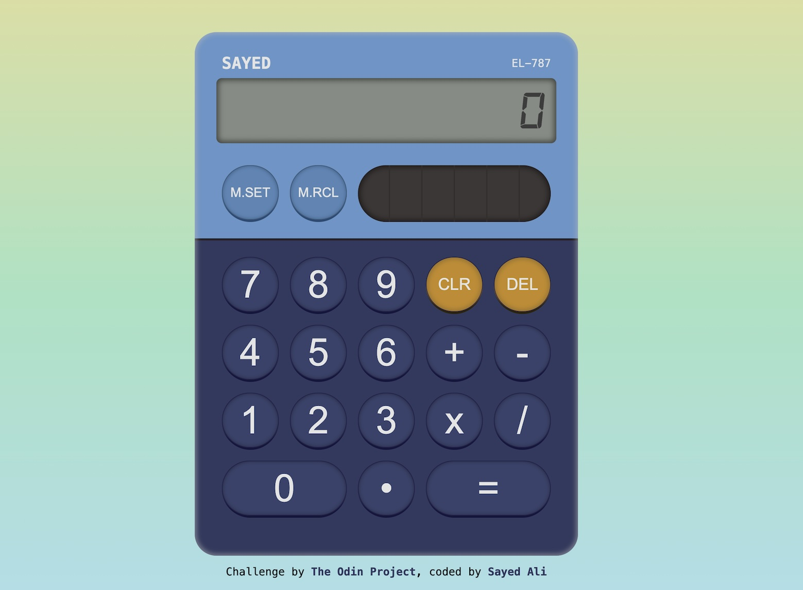

# The Odin Project - Project Calculator

This is a solution to the [Calculator project from The Odin Project](https://www.theodinproject.com/lessons/foundations-calculator).

- Solution on [GitHub](https://github.com/sydalwedaie/odin-project-calculator)
- Live Site on [Netlify](https://odin-project-calculator-f3sk8.netlify.app/)

## Features

- Use calculator buttons or keyboard to perform basic math operations.
- Display scientefic notation when the number can not fit the calculator screen.
- Store and recal numbers (with memory indicator) using the memory buttons.
- Delete digits, or clear the calculations entirely.

## What I learned

- Setting a background color on a child element hides the box-shadow set on the parent. I solved this issue with relative positioning of the parent, and setting a box-shadow on a pseudo-element that is absolutely positioned.

## What I Want to Improve

- The state management is a mess! The numbers stored in memory are sometimes in `number` type and other times `string`.
- I tried to implement a neomorphic design, though the shaows on some of the buttons and the device frame certainly need improvement.

## Acknowledgement

The design is based on the [SHARP EL-760R](https://sharpcalculators.com/products/el760rbbl) calculator.
